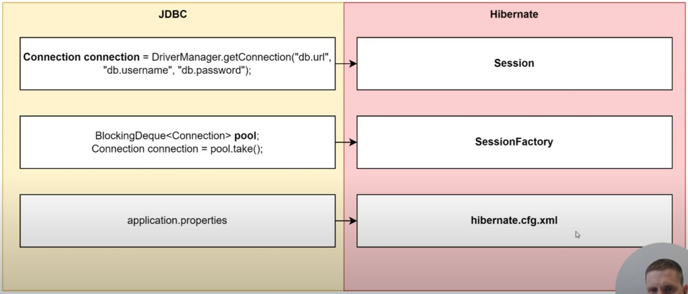
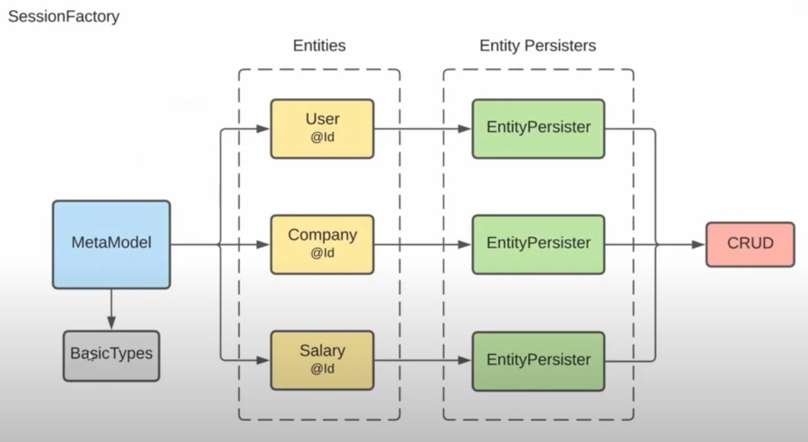
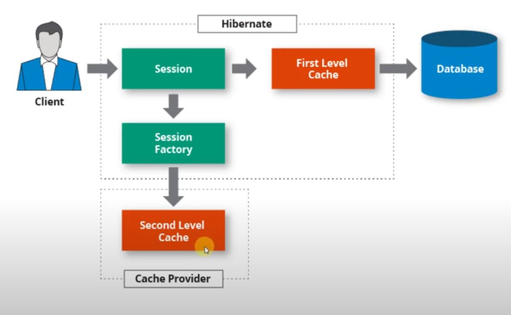
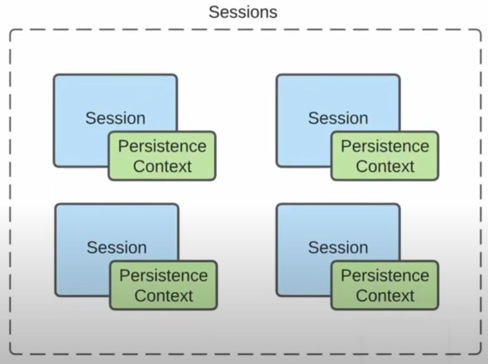
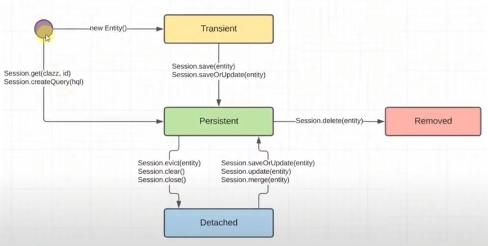
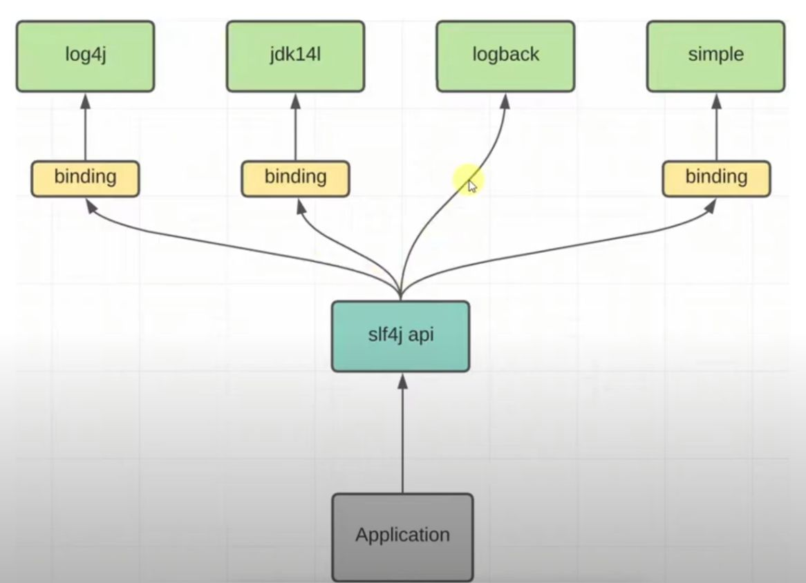

# Hibernate
[JavaGuru Hibernate (YouTube)](https://youtube.com/playlist?list=PLt91xr-Pp57T0OZk3hYqq8RiXOjNzsOH7&si=TGkzs2d_P7pZgAZr)

## Зачем нужен Hibernate?
1. Предоставляет готовый DAO (не нужно писать свой каждый раз)
2. Решает проблему сравнения объектов (в БД по ключу, в Java по полям)
3. Предоставляет инструмент кэширования запросов
4. Предоставляет инструмент управления транзакциями

## Пример использования Hibernate
1. Настраиваем зависимости
```
<dependencies>
	<dependency>
		<groupId>org.hibernate</groupId>
		<artifactId>hibernate-core</artifactId>
		<version>5.6.15.Final</version>
	</dependency>
	<dependency>
		<groupId>org.postgresql</groupId>
		<artifactId>postresql</artifactId>
		<version>42.6.0</version>
	</dependency>
<dependencies>
```

2. Создаем таблицу в БД
```
CREATE TABLE users
(
	username VARCHAR(128) PRIMARY KEY,
	firstname VARCHAR(128),
	lastname VARCHAR(128),
	birth_date DATE,
	age INT,
	role VARCHAR(32)
);
```

3. Настраиваем Hibernate

В папке с ресурсами (`src/main/resources`) создаем файл `hibernate.cfg.xml`
 
```
<?xml version='1.0' encoding='utf-8'?>
<!DOCTYPE hibernate-configuration PUBLIC
    "-//Hibernate/Hibernate Configuration DTD//EN"
    "http://hibernate.sourceforge.net/hibernate-configuration-3.0.dtd">
<hibernate-configuration>
    <session-factory>
        <property name="connection.url">jdbc:postgresql://localhost:5432/postgres</property>
        <property name="connection.driver_class">org.postgresql.Driver</property>
        <property name="connection.username">postgres</property>
        <property name="connection.password">root</property>
        <property name="show_sql">true</property>		<!-- Выводить генерируемые запросы в консоль -->
        <property name="format_sql">true</property>		<!-- Красиво форматировать выводимые запросы -->
        <property name="hibernate.dialect">org.hibernate.dialect.PostgreSQL10Dialect</property>		<!-- Диалект (синтаксис и тд.) -->
        <mapping class="by.javaguru.hibernate.starter.entity.User"/> <!-- Регистация Entity -->
    </session-factory>
</hibernate-configuration>
```

4.  Создаем объект конфигурации, фабрику сессий и сессию
```
import org.hibernate.cfg.Configuration;

public class HibernateRunner {
	public static void main(String[] args) {
		Configuration configuration = new Configuratoin();
		configuration.configure();
		// configuration.addAnnotatedClass(User.class);  // Регистрация entity в hibernate (или в hibernate.cfg.xml)
		configuration.setPhysicalNamingStrategy(new CamelCaseToUnderscoreNanimgStrategy()); // Стратегия названий (birthDate -> birth_date);
		configuration.addAttributeConverter(new BirthDateConverter(), true);
		try (var sessionFactory = configuration.buildSessionFactory();
			 var session = sessionFactory.openSession();) {
				session.beginTransaction();
				
				session.save(User.builder()
								.username("ivan@mail.ru")
								.firstname("Ivan")
								.lastname("Ivanov")
								.birthDate(LocalDate.of(2000, 01, 01)
								.age(23)
								.role(Role.ADMIN)
							.build());
				
				session.getTransaction().commit();
		 }
	}
}
```



5. Создание класса пользователя
```
@Data 				// Сгенерировать get, set, equals, hashCode, toString
@NoArgsConstructor 	// Создать конструктор без аргументов
@AllArgsConstructor // Создать конструктор со всеми аргументами
@Builder			// Добавление паттерна Builder
@Entity
@Table(name = "users", scheme = "public")
public class User {
	@Id
	private String username;
	private String firstname;
	private String lastname;
	@Convert(converter = BirthDateConverter.class)
	// @Column(name = "birth_date")
	private BirthDate birthDate;
	@Enumerated(EnumType.STRING)
	private Role role;
}

public enum  Role {
	ADMIN, USER
}
```

6. Создание класса BirthDate
```
public record BirthDate (LocalDate birthDate) {
	public long getAge() {
		return ChronoUnit.YEARS.between(birthDate, LocalDate.now());
	}
}
```

7. Создание конвертера атрибута BirthDate
```
public class BirthDateConverter implements AttributeConverter<BirthDate, Date> {
	@Override
	public Date convertToDatabaseColumn(BirthDate birthDate) {
		return Optional.ofNullable(birthDate)
				.map(BirthDate::birthDate)
				.map(Date::valueOf)
				.orElse(null);
	}
	
	@Override
	public BirthDate convertToEntityAttribute(Date date) {
		return Optional.ofNullable(date)
				.map(Date::toLocalDate)
				.map(BirthDate::new)
				.orElse(null);
	}
}
```

8. Создание своего типа
Для создания типа, не существующего в Java, можно реализовать свой тип:
```
public class MyType implements UserType {
	...
}
```
Либо импортировать `hibernate-types-52` maven.


## Основные команды Session

1. `sessoin.save(user)` - сохраняет нового пользователя
2. `session.update(user)` - выдает исключение, если такого пользователя нет
3. `session.saveOrUpdate(user)` - сохраняет нового пользователя или обновляет существующего
4. `session.delete(user)` - удаляет пользователя
5. `session.get(User.class, "ivan1@mail.ru")` - получение пользователя по ключу

## Entity Persister


## Cache

First Level Cache - по умолчанию, нельзя выключить (на уровне сессии)
Second Level Cache - опциональный, настраиваем самостоятельно (на уровне фабрики сессий)



First Level Cache - `Session.PersistenceContext` - отражает актуальное состояние базы, если в `PersistenceContext` есть сущность, то запрос в БД не пойдет.

Методы управления кэшем:
- `session.evict(user)` - удалить из кэша
- `session.clear()` - очистить кэш
- `session.close()` - при закрытии сессии, кэш удаляется
- `session.flush()` - обновляет БД в соответствии с `PersistenceContext`
- `session.refresh(user)` - обновляет entity в соответствии с БД
- `session.merge(user)` - обновляет persistent entity в соответствии с detached entity
- `session.isDirty()` - проверка, есть ли в кэше изменения, не примененные к БД

Любые изменения в `PersistenceContext` отразятся в БД при закрытии, даже без явного вызова `update`.

У каждой сессии свой кэш



## Жизненный цикл Entity

- Transient - сущность только что была создана и не находится в кэше 
- Persistent - сущность находится в кэше
- Removed - сущность удалена
- Detached - сущность не находится в кэше, но была в нем 



## JPA

Java Persistence API - спецификация Java, которая предоставляет набор интерфейсов/аннотаций для возможности сохранить в удобном виде Java объекты в базу данных и, наоборот, извлекать информацию из баз данных в виде Java объектов (ORM)

Hibernate (ORM framework) - это одна из реализаций JPA

## Логирование



```
<dependencies>
	<dependency>
		<groupId>org.slf4j</groupId>
		<artifactId>slf4j-log4j12</artifactId>
		<version>2.0.7</version>
	</dependency>
<dependencies>
```

log4j.xml
```
<?xml version='1.0' encoding='utf-8'?>
<!DOCTYPE log4j:configuration SYSTEM "log4j.dtd">

<log4j:configuration>
	<appender name="console" class="org.apache.log4j.ConsoleAppender">
		<param name="target" value="System.out"/>
		
		<layout class="org.apache.log4j.PatternLayout">
			<param name="conversionPattern" value="[%d{HH:mm:ss,SSS}] %p [%c: %L] %m%n"/>
		</layout>

		<root>
			<level value="trace"/>
			<appender-ref ref="console"/>
		</root>
</log4j:configuration>
```

```
import org.slf4j.Logger;
...
	private static final Logger log = LoggerFactory.getLogger(HibernateRunner.class);
...
	log.info("User object in transient state: {}", user);
	log.warn("User object in transient state: {}", user);
	log.error("User object in transient state: {}", user);
```

## Встроенные компоненты

- `@Embeddable` - этой аннотацией отмечается встроенный компонент
- `@Embedded` - над полем встроенного компонента, не обязательная аннотация
- `@AttributeOverride(name = "birthDate", column = @Column(name = "birth_date"))` - над полем встроенного компонента, указывает как поле называется в БД 

## Стратегии генерации первичного ключа

```
@Id
@GenerateValue(strategy = GenerationType.AUTO)
private Long id;
```

- `AUTO` - зависит от БД (Postgres - SEQUENCE)
- `IDENTITY` - когда БД ответственна за генерацию ключа
- `SEQUENCE` - использует определенную последовательность
- `TABLE` - устаревшая

## Составной ключ

```
public class PersonalInfo implements Serializable {
	@Serial
	private static final long serialVersionUID = 1L;
	
	private String username;
	private String firstname;
	private String lastname;
}
```

```
@EmbeddedId
private PersonalInfo personalInfo;
```