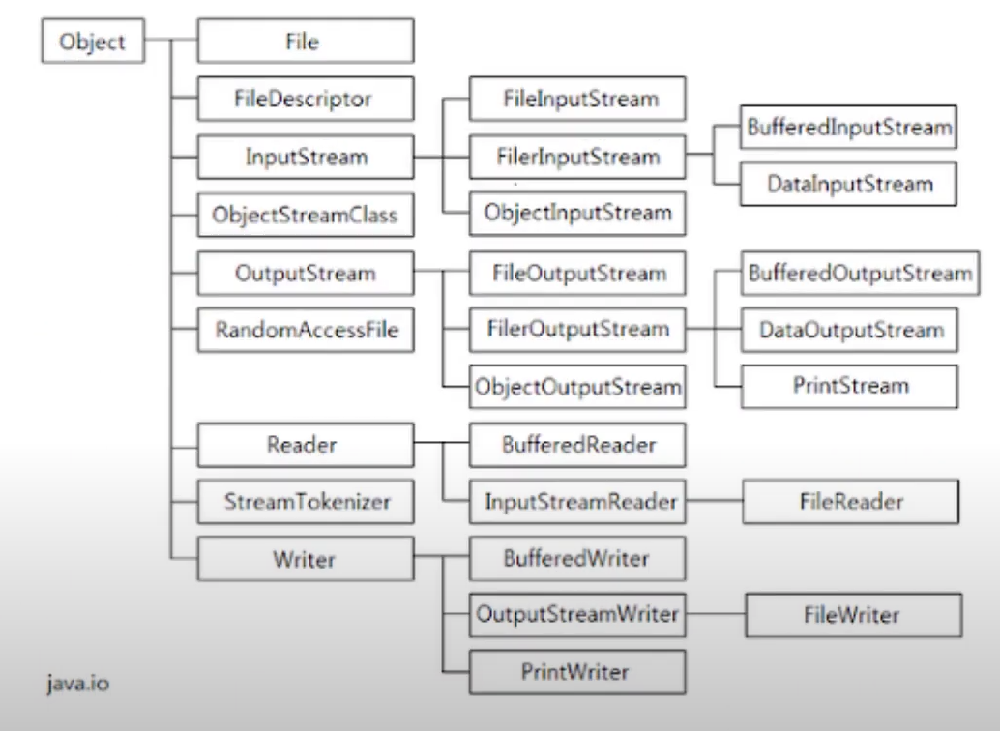

# Потоки ввода/вывода

## Ресурсы

[Java Guru 26. Потоки ввода/вывода, java IO (Java Core с нуля, полный курс)](https://youtu.be/WEcf1TZhBLs?feature=shared)

## Управление файлами

### Класс File (JDK 22)

Позволяет
- Создавать/удалять/изменять файлы и папки
- Получать информацию о файлах и папках

### Конструкторы File
- `File(URI)`
- `File(String pathName)`
- `File(File parent, String child)`
- `File(String parent, String child)`

### Методы File
- `createNewFile()` - атомарная, поднимает IOException, SecurityException - нет прав, не должна использоваться для создания lock файлов (вместо этого ипользуйте FileLock)
- `mkdir()`
- `listFiles()`
- `getAbsolutePath()`
- `exists()`
- `getName()`
- `getParent()`
- `getPath()` - относительный путь
- `lastModified()`
- `isFile()`
- `isDirectory()`
- `delete()`

## Запись/чтение файлов



Запись и чтение можно производить в двух режимах:
- байтовый
	- `InputStream`
	- `OutputStream`
- символьный(текстовый)
	- `Reader`
	- `Writer`

При работе с тексовыми файлами удобно использовать символьные потоки, однако для их корректной работы необходимо знать некоторую информацию о файле, например кодировку. Если кодировка не известна и не играет никакой роли в рамках решаемой задачи, то можно использовать байтовые потоки.

Для чтения текста можно использовать `Scanner`, который может работать с любым источником данных (в том числе `FileReader` и `InputStream`).

Методы `InputStream`:
- `read()`
- `read(byte cbuf[])`
- `read(byte cbuf[], int offset, int length)`

Методы `Reader`:
- `read()`
- `read(char cbuf[])`
- `read(char cbuf[], int offset, int length)`

Методы `OutputStream`:
- `write()`
- `write(byte cbuf[])`
- `write(byte cbuf[], int offset, int length)`

Методы `Writer`:
- `write()`
- `write(char cbuf[])`
- `write(char cbuf[], int offset, int length)`

### Реализации

`FileWriter`

- `FileWriter("c:\notes.txt", false)` - false значит перезаписать файл, а не дополнять его

- `write(text)`
- `append(text)`
- `flush()`

`FileReader`

- `FileReader("c:\notes.txt")`

- `read()` - прочитать один символ
- `read(buf)` - прочитать buf.length символов

`FileOutputStream`

- `FileOutputStream("c:\notes.txt")`

- `write(buf, 0, buf.length)`

`FileInputStream`

- `FileInputStream("c:\notes.txt")`

- `read()` - прочитать один символ
- `read(buf)` - прочитать buf.length символов

## Буферизация

Буферизация с помощью классов `FileReader` и `FileInputStream` громоздка:

```
char[] buf = new char[256];
int c;
while((c = reader.read(buf)) > 0) {
	if (c < 256) {
		buf = Arrays.copyOf(buf, c);
	}
	System.out.print(buf);
}
```

Поэтому существуют классы-обертки:
- `BufferedReader`
- `BufferedWriter`
- `BufferedInputStream`
- `BufferedOutputStream`

```
BufferedReader in = new BufferedReader(new FileReader("file.txt"));
```

Для чтения всей строки есть метод:
- `readLine()`

`Buffered` стримы работают быстрее